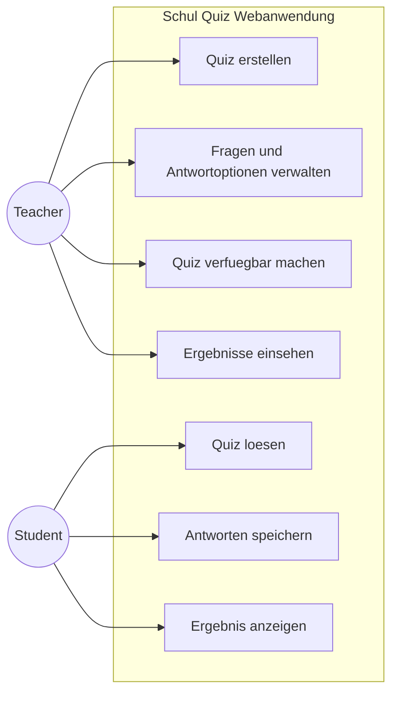
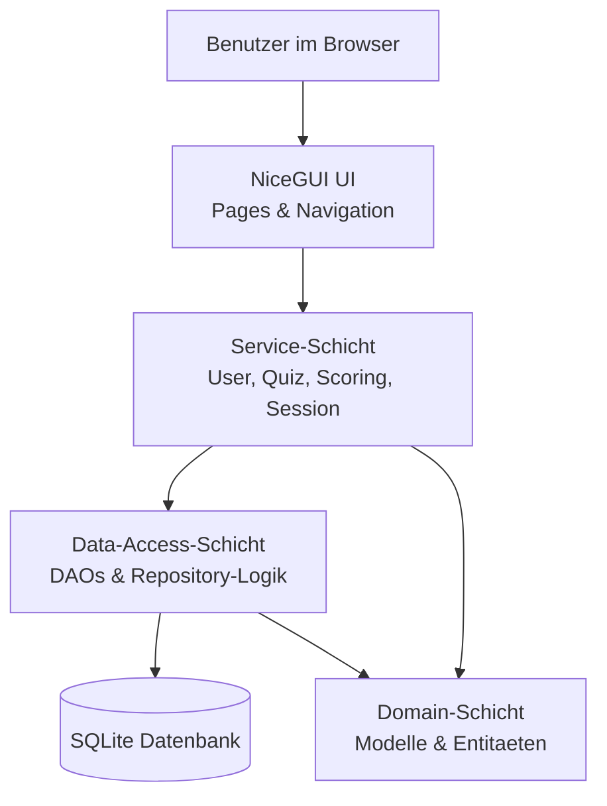

# Schul Quiz Webanwendung

Browserbasierte Quiz-App fuer den schulischen Einsatz, entwickelt mit Python, NiceGUI und SQLModel.

Diese Anwendung richtet sich an Lehrpersonen und Lernende:
- Lehrpersonen erstellen Quizze und verwalten Fragen.
- Schuelerinnen und Schueler loesen Quizze im Browser.
- Ergebnisse werden gespeichert und ausgewertet.

## Inhaltsverzeichnis

- [Features](#features)
- [Tech-Stack](#tech-stack)
- [Projektstatus](#projektstatus)
- [Schnellstart](#schnellstart)
- [Installation](#installation)
- [Anwendung starten](#anwendung-starten)
- [Nutzung](#nutzung)
- [Projektstruktur](#projektstruktur)
- [Architektur](#architektur)
- [Datenmodell](#datenmodell)
- [Use-Case-Diagramm](#use-case-diagramm)
- [Tests](#tests)
- [Troubleshooting](#troubleshooting)
- [Roadmap](#roadmap)
- [Beitrag leisten](#beitrag-leisten)
- [Lizenz](#lizenz)

## Features

- Benutzerverwaltung mit Rollen:
	- Teacher
	- Student
- Registrierung und Login
- Quizverwaltung:
	- Quiz erstellen
	- Fragen und Antwortoptionen verwalten
	- Quiz verfuegbar machen
- Fragetypen:
	- Multiple Choice
	- True/False
    - Single Choice
- Quiz-Durchfuehrung inkl. Speicherung der Antworten
- Ergebnisanzeige mit Score nach Abschluss
- Persistente Speicherung in SQLite

## Projektkontext

### Ausgangssituation

Im schulischen Alltag werden Quizze und Auswertungen oft manuell oder ueber mehrere Tools hinweg verwaltet. Das fuehrt zu Medienbruechen, unklaren Ergebnissen und hohem organisatorischem Aufwand.

### Zielsetzung

Die Anwendung soll den kompletten Ablauf in einem System abdecken:

- Quizze zentral erstellen und pflegen
- Quizze browserbasiert durchfuehren
- Ergebnisse reproduzierbar speichern und anzeigen

## Anwendungsfaelle

### 1. Quiz erstellen (Teacher)
Als Teacher moechte ich Quizze und Fragen im Browser erstellen, damit Lernende direkt damit arbeiten koennen.

- Eingaben: Quizdaten, Fragetext, Antwortoptionen
- Ergebnis: gespeichertes Quiz mit Fragen

### 2. Quiz loesen (Student)
Als Student moechte ich ein verfuegbares Quiz starten und beantworten, damit ich mein Wissen testen kann.

- Eingaben: Antworten pro Frage
- Ergebnis: abgeschlossene QuizSession

### 3. Ergebnis anzeigen
Als Student moechte ich nach Abschluss mein Resultat sehen, damit ich meinen Lernstand einschaetzen kann.

- Eingaben: abgeschlossene Session
- Ergebnis: Score und Rueckmeldung

### 4. Ergebnisse nachvollziehen (Teacher)
Als Teacher moechte ich Ergebnisse nachvollziehen koennen, damit ich den Lernfortschritt bewerte.

- Eingaben: Quiz/Session-Kontext
- Ergebnis: gespeicherte Ergebnisdaten

## Tech-Stack

- Python
- NiceGUI
- SQLModel
- SQLAlchemy
- SQLite
- python-dotenv

## Projektstatus

Das Projekt befindet sich in einem funktionsfaehigen Entwicklungsstand.

- Datenbank und ORM-Grundstruktur sind vorhanden
- Benutzerverwaltung mit Rollen ist umgesetzt
- Quizverwaltung ist umgesetzt
- Quiz-Durchfuehrung und Ergebnisanzeige sind umgesetzt
- Die Browser-UI wird weiter verfeinert

## Erfuellung der Projektkriterien

Dieses Projekt erfuellt die zentralen Anforderungen aus dem Modul:

1. Browserbasierte App mit NiceGUI
2. Datenvalidierung bei Benutzereingaben
3. Datenbankmanagement ueber ORM

### 1) Browser-App (NiceGUI)

- Serverseitige App-Logik in Python
- Thin-Client-Ansatz im Browser
- Interaktive Seiten fuer Teacher- und Student-Workflows

### 2) Datenvalidierung

- Eingaben werden geprueft, bevor Daten gespeichert werden
- Unerlaubte oder unvollstaendige Eingaben werden abgefangen
- Ziel: konsistente Daten und robuste Nutzerfuehrung

### 3) ORM und Persistenz

- SQLModel/SQLAlchemy fuer Mapping zwischen Objekten und SQLite
- Strukturierter Zugriff ueber DAOs
- Nachvollziehbare Trennung von Datenzugriff und Geschaeftslogik

## Schnellstart

```bash
cd python_programing
py -m venv .venv
.venv\Scripts\Activate.ps1
pip install -r requirements.txt
py main.py
```

Danach im Browser oeffnen:

http://localhost:8080

## Installation

### Voraussetzungen

- Python 3.11 oder neuer (empfohlen)
- pip
- Windows PowerShell (fuer die Befehle unten)

### Lokale Einrichtung

```bash
# 1) In den Projektordner wechseln
cd python_programing

# 2) Virtuelle Umgebung erstellen
py -m venv .venv

# 3) Virtuelle Umgebung aktivieren
.venv\Scripts\Activate.ps1

# 4) Abhaengigkeiten installieren
pip install -r requirements.txt
```

## Anwendung starten

Es gibt zwei gueltige Startvarianten:

```bash
# Variante A: Haupt-Launcher
py main.py

# Variante B: Modulstart
py -m quiz_app
```

Standardwerte:

- URL: http://localhost:8080
- Host: 0.0.0.0
- Port: 8080

## Nutzung

### Teacher-Flow

1. Account erstellen oder einloggen
2. Neues Quiz anlegen
3. Fragen und Antwortoptionen erfassen
4. Quiz fuer Lernende verfuegbar machen

### Student-Flow

1. Account erstellen oder einloggen
2. Verfuegbares Quiz auswaehlen
3. Fragen beantworten und abschliessen
4. Ergebnis und Score einsehen

## Abbildungen und Diagramme

Zur vollstaendigen Dokumentation sind folgende Abbildungen vorgesehen:

- 2 bis 4 UI-Screenshots (Login, Quizverwaltung, Quizdurchfuehrung, Ergebnis)
- 1 Architekturdiagramm (Layer/Komponenten)
- optional 1 ER-Diagramm fuer Datenmodell

Die Abbildungen koennen bei Bedarf in einem docs-Ordner abgelegt und im README eingebunden werden.

## Use-Case-Diagramm



### Haupt-Use-Cases

- Teacher
	- Quiz erstellen
	- Fragen und Antwortoptionen verwalten
	- Quiz verfuegbar machen
	- Ergebnisse einsehen
- Student
	- Quiz loesen
	- Antworten speichern
	- Ergebnis anzeigen

## Projektstruktur

```text
python_programing/
|-- main.py
|-- requirements.txt
|-- README.md
|-- quiz_app.db
|-- test_quiz_app.py
|-- quiz_app/
|   |-- __init__.py
|   |-- __main__.py
|   |-- application.py
|   |-- data_access/
|   |   |-- __init__.py
|   |   |-- db.py
|   |   |-- dao.py
|   |   `-- seed.py
|   |-- domain/
|   |   |-- __init__.py
|   |   `-- models.py
|   |-- services/
|   `-- ui/
`-- .vscode/
```

## Architektur

Die Anwendung ist in einer mehrschichtigen Struktur aufgebaut:



- UI-Schicht:
	- NiceGUI-Seiten und Navigation
- Service-Schicht:
	- Geschaeftslogik (Benutzer, Quiz, Scoring, Session)
- Data-Access-Schicht:
	- DAOs fuer den Datenzugriff
- Domain-Schicht:
	- Entitaeten und Datenmodelle

Begruendung der Struktur:

- bessere Testbarkeit
- klare Verantwortlichkeiten
- einfachere Erweiterbarkeit

## Datenmodell

Haupttabellen und Objekte:

- User
- Quiz
- Question
- AnswerOption
- QuizSession
- QuestionAnswer

Wesentliche Beziehungen:

- Ein User kann mehrere Quizze erstellen.
- Ein Quiz enthaelt mehrere Fragen.
- Eine Frage enthaelt mehrere Antwortoptionen.
- Eine QuizSession enthaelt mehrere beantwortete Fragen.

Die Datenbank wird beim Start initialisiert und bei Bedarf mit Seed-Daten vorbereitet.

## Tests

Die Tests dienen als Nachweis, dass die fachlichen Anforderungen nicht nur implementiert, sondern auch nachvollziehbar pruefbar sind. Geprueft werden fachliche Logik, Datenbankverhalten und typische Benutzerablaeufe.

### Ziel der Tests

- Nachweis der korrekten Berechnung und Auswertung
- Pruefung der Persistenz in der Datenbank
- Absicherung der zentralen Benutzerablaeufe
- Erkennung von Validierungsfehlern und Rollenfehlern

### Ausfuehrung

```bash
pytest -q
```

### Testumfang

Der Testumfang umfasst insgesamt 12 Tests:

- 6 Unit Tests
- 3 DB Tests
- 3 Integration Tests

### Unit Tests

| Testfall | Pruefziel |
|---|---|
| Scoring bei allen korrekten Antworten | Der Score wird mit 100% berechnet. |
| Scoring bei teilweise korrekten Antworten | Die Bewertung erfolgt anteilig. |
| Rollenpruefung Teacher/Student | Ein Teacher kann Quizze erstellen, ein Student nicht. |
| Validierung: Fragetext erforderlich | Unvollstaendige Eingaben werden abgelehnt. |
| Validierung: Mindestens zwei Antwortoptionen | Eine Frage wird nur bei gueltiger Mindestanzahl gespeichert. |
| True/False-Auswertung | Die Antwortlogik fuer Ja/Nein-Fragen arbeitet korrekt. |

### DB Tests

| Testfall | Pruefziel |
|---|---|
| Quiz-Speicherung und -Abruf | Gespeicherte Quizze koennen wieder geladen werden. |
| Fragen und Antwortoptionen persistent | Die Beziehungen zwischen den Datensaetzen bleiben erhalten. |
| Quiz-Session mit Antworten | Eine Session speichert Antworten vollstaendig und korrekt. |

### Integration Tests

| Testfall | Pruefziel |
|---|---|
| End-to-End Teacher-Flow | Ein Teacher registriert sich, erstellt ein Quiz mit fuemf Fragen und speichert erfolgreich. |
| End-to-End Student-Flow | Ein Student loest ein Quiz, speichert Antworten und erhaelt ein Ergebnis. |
| Vollstaendiger Workflow | Mehrere Studenten bearbeiten dasselbe Quiz und erhalten nachvollziehbare Ergebnisse. |

### Testfall-Template

Zur einheitlichen Dokumentation kann folgender Aufbau verwendet werden:

1. Testfall-ID
2. Beschreibung/Ziel
3. Vorbedingungen
4. Testschritte
5. Eingabedaten
6. Erwartetes Ergebnis
7. Tatsaechliches Ergebnis
8. Status (Pass/Fail)

### Bewertungsrelevanz

Die Tests belegen, dass die Kernfunktionen reproduzierbar funktionieren und die Anwendung nicht nur visuell, sondern auch fachlich abgesichert ist.
9. Bemerkungen

## Troubleshooting

- Port 8080 ist bereits belegt:
	- Laufenden Prozess beenden oder mit anderem Port starten.
- Importfehler bei NiceGUI oder SQLModel:
	- virtuelle Umgebung aktivieren
	- Abhaengigkeiten erneut installieren
- Datenbank soll zurueckgesetzt werden:
	- quiz_app.db sichern und dann loeschen
	- App neu starten, damit Schema neu angelegt wird

## Weiterentwicklung

- UI/UX weiter verbessern
- Statistik und Auswertung erweitern
- Exportfunktionen fuer Ergebnisse
- Optional: Rollen- und Rechtekonzept weiter ausbauen

## 👥 Team & Contributions

> 🚧 Fill in the names of all team members and describe their individual contributions below.

| Name      | Contribution |
|-----------|--------------|
| Student A | NiceGUI UI + documentation |
| Student B | Database & ORM + documentation |
| Student C | Business logic + documentation |

## Lizenz

Fuer das Projekt ist aktuell keine Lizenz hinterlegt.
Falls das Repository oeffentlich genutzt werden soll, wird eine Lizenzdatei empfohlen (z. B. MIT).
